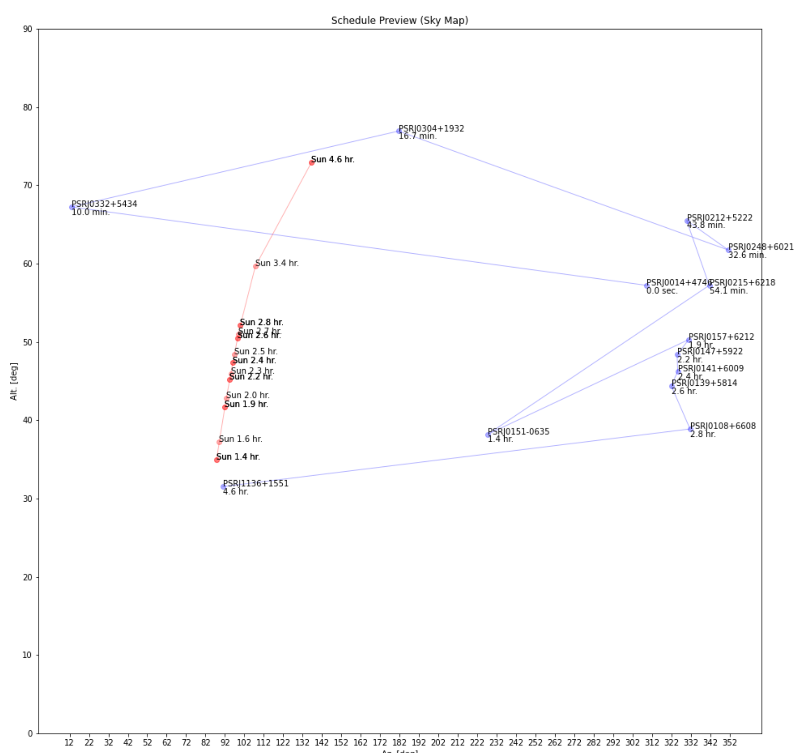

# AstroScheduller Commands

After the scheduling process finished, you can start entering commands when "[scheduller] >" is shown in the command line **(usually you to close the pop-up windows to before the entering)**.

## Command: preview

Usually, the output will contain multiple possibilities of combinations. The "preview" command allows you to see different combinations.

### Usage

```bash
[Scheduller] > preview [series_number]
```

where "[series_number]" is the number of the combination to be previewed, the lower series number means the better the combination (higher score). In other words, if you want to preview the best combination, you need to use the command.

### Example

```bash
[Scheduller] > preview 1
```

### Diagram


The above figure is a preview of the generated observation plan by the script, where:
 - The gray vertical line marked as number "1" is the cut-off point for the previous and next object observations; 
 - The red vertical line at "2" indicates the end of the observation;
 - The colored bolded line at "3" is the source currently under observation;
 - The line marked as "4" is the solar altitude;
 - The thin black line at number "5" is the "gap" between the sources.

## Command: save

The save command allows you to save the result of the last preview. In other words, if you previewed the layout with the number "1" (by command "preview 1"), you can use the save command to save and export the generated plan "1".

### Usage

```bash
[Scheduller] > save [format] [filename]
```

where "[format]" is the output format of the scheduling results (see the table below), and "[filename]" is the filename of the exported plan.

| **Format**           | **Commands**    | **Notes**                                                    |
| :------------------- | :-------------- | :----------------------------------------------------------- |
| SCHED (*.key) format | "sched", ".key" | The file exported is only the observation part of the SCHED .key file. This command will also general a file named as "[filename]_sources.txt", which is the sources part of the SCHED file. |

### Example

```bash
[Scheduller] > save sched sorted.txt
```


## Command: show

The "show" command allows you to display information about the last previewed plan. In other words, if the last previewed scheduling result is numbered "1" (by command "preview 1"), the information viewed with the "show" command is the information of plan "1".

### Command: show scheduled/not scheduled

Use the "show" command followed by the "scheduled/not scheduled" parameter to see the scheduled or not scheduled objected names in the scheduling results (observation plan).

```bash
[Scheduller] > show scheduled
j0014+4746 j0332+5434 j0304+1932 j0248+6021 j0212+5222
[Scheduller] > show not scheduled
j0152-1637 j0055+5117 j0034-0721 j0134-2937 j1640+2224
```

### Command: show skymap

Use the "skymap" parameter after the "show" command to see the orientation, altitude, and distance to the sun related to observed objects.

```bash
[Scheduller] > show skymap
```

The script returns a graph with the x-axis in azimuth and the y-axis in altitude.



The time when the object is observed is indicated below the identifier of the object. The angle between the object and the Sun can be obtained by comparing the their positions in the figure at the same indicated time. Also, the path of the observation on the sky can also be seen from this figure. Sometimes, the path of the sun is not visible because it is not in the field of view of the figure.

## Command: edit

The "edit" command can be used to edit the plan. **But please be sure that the "edit" command can only used after a "save" command. Please save the plan into the SCHED format. **

### Example

```bash
[Scheduller] > save sched sorted.txt
[Scheduller] > edit sorted.txt
```

### Scheduller Editor

Few seconds after the "save" command, the script will pop up the Scheduller Editor. The editor will automatically generate a plan preview when it start. 


#### Move the row up/down

By using the keyboard shortcut "Alt/Cmd+Up" or "Alt/Cmd+Down", the row that the cursor on will be moved according up and down.

#### Reload preview diagram (Save & Plot)

By using the button "File > Save & Plot" in the upper left corner of the editor to refresh the preview diagram.

(Shortcut: Ctrl/Cmd + S)

#### Reload SkyMap (Save & Show SkyMap)

By using the button "File > Save & Show SkyMap" in the upper left corner of the editor to refresh the SkyMap.

(Shortcut: Ctrl/Cmd + P)

#### Compute Gap (Save & Compute Gaps)

By using the button "File > Save & Compute Gaps" in the upper left corner of the editor to compute gaps. **Note that the gap shown in the pop-up is computed based on telescope rotation time. **

#### Reload Text (reload)

Recover the plan (schedule) to the last saved version.

#### Always on Top (Always on Top)

After starting the editor, you can pin the window on top by using "Window > Always on top" in the upper left corner of the editor window.

## Command: exit

Exit the script with the command "exit" (equivalent to Ctrl+C).

```bash
[Scheduller] > exit
```

