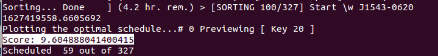

# Tips & Tricks

## Run the script in segments

Since Python scripts usually take up only one CPU thread, you can make maximum use of the CPU by running scripts in segments.

### Usage Scenarios

When we have about 300 sources to schedule into a 12-hour observation, it may takes about several hours. We can make it faster by running it in segments.

Our algorithm implies that 300 sources have 300 combinations of possibilities (see appendix), therefore 6 python processes can be started which each of them calculating 50 possibilities (6*50=300). 

We can ask the script to segment the process by adding the following parameter after the script start command.

```bash
python SchedullerVersion2.0.py psr_list.txt [start] [end]
```

Thus

```bash
% Start a new Shell window in the script directory and run the command (1-50)
python SchedullerVersion2.1.2.py psr_list.txt 1 50
% Start a new Shell window again in the scripts directory and run the command (50-100)
python SchedullerVersion2.1.2.py psr_list.txt 50 100
% Start a new Shell window again in the scripts directory and run the command (100-150)
python SchedullerVersion2.1.2.py psr_list.txt 100 150
% Start a new Shell window again in the scripts directory and run the command (150-200)
python SchedullerVersion2.1.2.py psr_list.txt 150 200
% Start a new Shell window again in the scripts directory and run the command (200-250)
python SchedullerVersion2.1.2.py psr_list.txt 200 250
% Start a new Shell window again in the scripts directory and run the command (250-300)
python SchedullerVersion2.1.2.py psr_list.txt 250 300
```

After each segment of the script is finished, the best observation plan (schedule) can be identified by looking at the score of each best schedule generated by each "sub-process" (each segment).



* AstroScheduller Version >= 2.1.2

## Generate an offline database

When the script runs online and encounters a source that is not defined in the database, it downloads the data from SIMBAD via the Astropy package and appends it to end of the database. After the coordinates are downloaded, they are appended to the offline database ("sources.db") and no need to be download again in the future.

We can use this feature to quickly generate an offline database. Write all names of object that needed  into the source table in the format described in the first part of this document, and run the script on a networked computer. The database will be automatically generated (if there is no sources.db file under the directory, the script will automatically generate the file). When the script displays "Preprocessing... Done", the database is generated.

## Use command line while previewing plans (multi-threading)

It can be noticed that after using the "preview" or "show skymap" command, a new window will pop up, and the command line will get frozen. This is because Python runs single-threaded.

The script has a built-in multi-threaded mode implemented by the _thread package. However, **please note that this mode has been tested failed in some devices by reporting the error "core dumped"**. Therefore, please test the function before using it. 

If you want to run in multi-threaded mode, please replace the command "preview" with "preview\_" and "skymap" with "skymap\_":

```bash
[Scheduller] > preview_ 1
[Scheduller] > show skymap_
```
